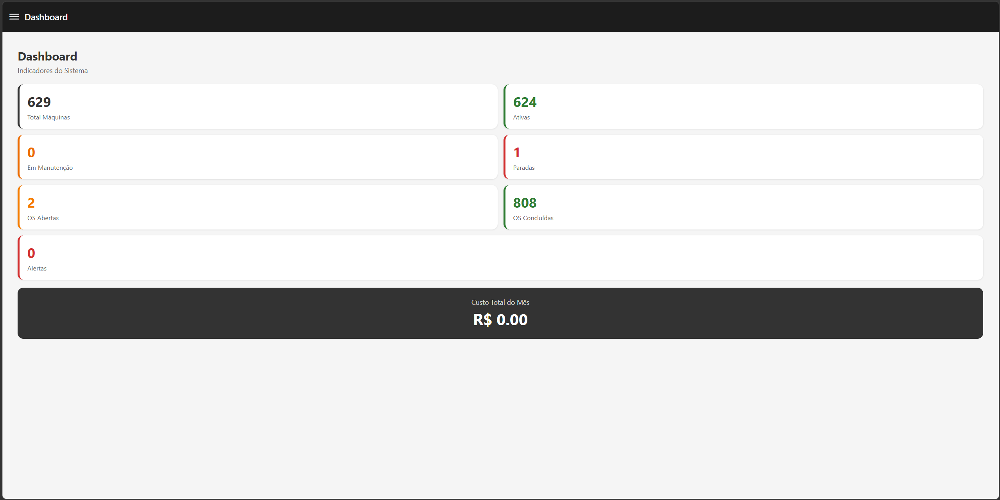
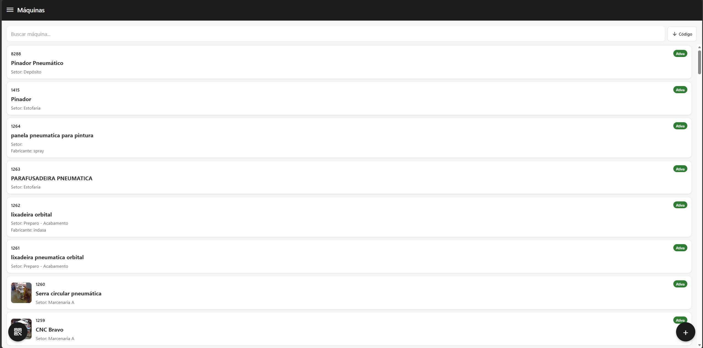
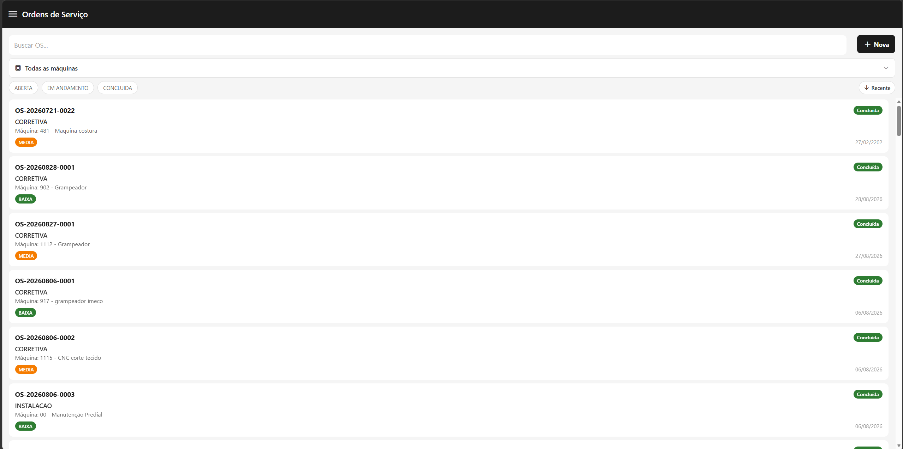
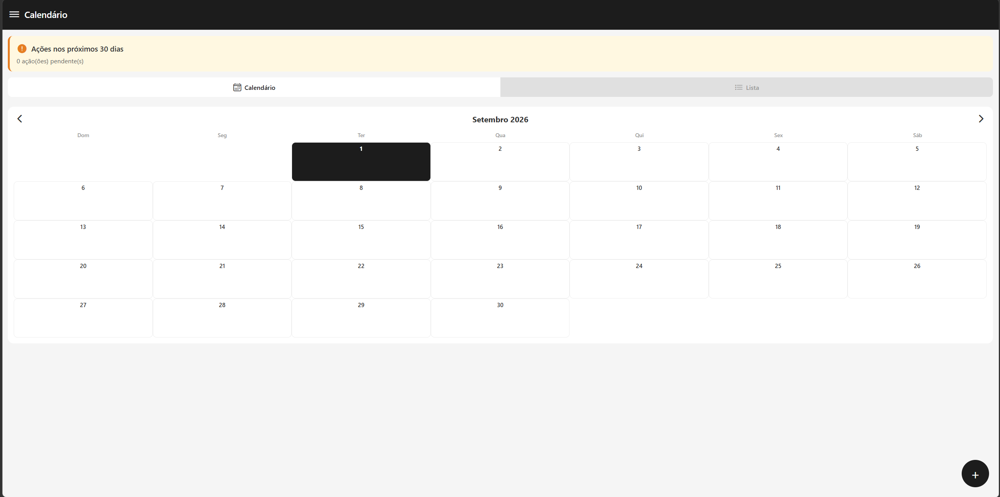
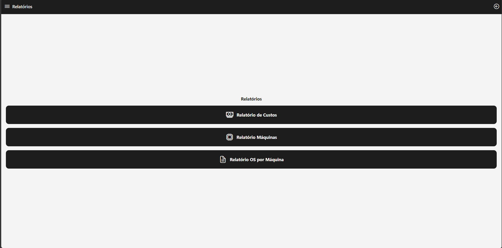

# Sistema de Controle de Manutenção

Sistema full-stack para gerenciamento de manutenção industrial, desenvolvido para centralizar o controle de máquinas, ordens de serviço, manutenções preventivas, fornecedores, setores, documentos e indicadores operacionais.

A solução é composta por uma **API REST desenvolvida em Java/Spring Boot**, uma **interface web integrada ao backend** e um **aplicativo mobile desenvolvido com React Native e Expo**.

> Projeto desenvolvido como solução de gerenciamento de manutenção, com foco em organização dos ativos, rastreabilidade das intervenções, controle de custos e mobilidade para equipes de manutenção.

---

## Visão geral

O sistema permite acompanhar todo o ciclo de manutenção de equipamentos, desde o cadastro da máquina e planejamento de manutenções preventivas até a abertura, execução e conclusão de ordens de serviço.

A aplicação também disponibiliza recursos como:

- Autenticação e autorização por perfil;
- Cadastro e gerenciamento de máquinas;
- Identificação de máquinas por QR Code;
- Ordens de serviço;
- Manutenção preventiva;
- Checklists;
- Controle de custos;
- Gestão de fornecedores;
- Gestão de setores;
- Dashboard gerencial;
- Relatórios em PDF e CSV;
- Upload e download de documentos e imagens;
- Organização de anexos em pastas;
- Funcionamento offline no aplicativo mobile;
- Sincronização posterior dos dados;
- Distribuição do aplicativo Android.

---

## Arquitetura

O projeto é dividido em duas aplicações principais:

```text
controle-manutencao/
│
├── manutencaobackend/
│   └── API REST Spring Boot
│       ├── Frontend Web
│       ├── Regras de negócio
│       ├── Autenticação
│       ├── Persistência
│       ├── Relatórios
│       ├── Upload de arquivos
│       └── Distribuição do APK
│
└── manutencao-mobile/
    └── Aplicativo React Native / Expo
        ├── Interface mobile
        ├── Autenticação
        ├── QR Code
        ├── Anexos
        ├── Funcionamento offline
        └── Sincronização
```

### Fluxo de comunicação

```text
┌───────────────────────────────┐
│       Aplicativo Mobile       │
│   React Native + Expo         │
│                               │
│ Axios + JWT                   │
└───────────────┬───────────────┘
                │
                │ REST API
                ▼
┌───────────────────────────────┐
│        Spring Boot            │
│          REST API             │
│                               │
│ Controller                    │
│      ↓                        │
│ Service                       │
│      ↓                        │
│ Repository                    │
│      ↓                        │
│ JPA / Hibernate               │
└───────────────┬───────────────┘
                │
                ▼
┌───────────────────────────────┐
│          H2 Database          │
│        Banco relacional       │
└───────────────────────────────┘

                +

┌───────────────────────────────┐
│       Frontend Web            │
│       Expo Web Export         │
└───────────────┬───────────────┘
                │
                ▼
          Spring Boot
```

O backend segue uma organização baseada em **Controller → Service → Repository**, utilizando DTOs, Spring Data JPA e Hibernate.

---

# Funcionalidades

## Autenticação e autorização

O sistema utiliza autenticação baseada em **JWT**, com senhas protegidas utilizando BCrypt.

São disponibilizados três níveis de acesso:

| Perfil | Descrição |
|---|---|
| `ADMIN` | Administração completa do sistema |
| `COORD` | Gestão operacional e acesso a recursos gerenciais |
| `USER` | Operações relacionadas à execução das manutenções |

O controle de acesso é realizado através de RBAC (Role-Based Access Control).

---

## Gestão de máquinas

Permite cadastrar e gerenciar os equipamentos utilizados no ambiente de manutenção.

Entre as informações e recursos disponíveis estão:

- Dados técnicos;
- Identificação;
- Setor;
- Fornecedores;
- QR Code;
- Anexos;
- Pastas de documentos;
- Histórico de manutenção.

O QR Code permite identificar rapidamente uma máquina através do aplicativo mobile.

---

## Ordens de serviço

As ordens de serviço controlam o ciclo completo de uma intervenção de manutenção.

### Fluxo

```text
ABERTA
   │
   ▼
EM_ANDAMENTO
   │
   ├──────────────► CANCELADA
   │
   ▼
CONCLUÍDA
```

A numeração das ordens é gerada automaticamente utilizando o formato:

```text
OS-yyyyMMdd-NNNN
```

O sistema também realiza o cálculo automático dos custos da ordem de serviço e atualiza informações relacionadas aos planos preventivos quando uma OS é concluída.

---

## Manutenção preventiva

Permite planejar e acompanhar manutenções periódicas.

### Fluxo

```text
Criar plano
     ↓
Definir periodicidade
     ↓
Calendário
     ↓
Executar manutenção
     ↓
Atualizar última execução
     ↓
Calcular próxima execução
```

Os planos podem possuir:

- Periodicidade;
- Checklist;
- Datas de execução;
- Próxima execução;
- Status;
- Reagendamento automático.

A próxima execução é calculada com base na última execução e na periodicidade configurada.

---

## Dashboard

O sistema possui um dashboard gerencial com indicadores relacionados à operação de manutenção.

Entre os indicadores estão:

- Quantidade de máquinas;
- Ordens de serviço;
- Status das OS;
- Custos;
- Indicadores por máquina;
- Indicadores por setor.

---

## Relatórios

O backend possui geração de relatórios gerenciais.

Os relatórios podem apresentar informações relacionadas a:

- Custos;
- Performance;
- Máquinas;
- Setores;
- Ordens de serviço.

Também é possível exportar informações em:

- PDF;
- CSV.

---

## QR Code

Cada máquina pode possuir um QR Code para identificação.

No aplicativo mobile é possível utilizar a câmera do dispositivo para realizar a leitura do código.

```text
QR Code da máquina
       ↓
Scanner Mobile
       ↓
Identificação da máquina
       ↓
Consulta das informações
       ↓
Acesso às funcionalidades de manutenção
```

---

## Anexos e documentos

O sistema permite associar arquivos às máquinas e ordens de serviço.

São suportados, entre outros:

- Fotos;
- PDFs;
- Documentos;
- Arquivos relacionados à manutenção.

Os arquivos podem ser organizados através de uma estrutura de pastas.

---

## Funcionamento offline

O aplicativo mobile possui suporte a funcionamento offline.

Quando não existe conexão disponível, determinadas informações podem ser armazenadas localmente e posteriormente sincronizadas com o servidor.

A implementação utiliza recursos como:

- AsyncStorage;
- NetInfo;
- Controle de conectividade;
- Sincronização posterior.

Esse mecanismo foi desenvolvido para permitir maior flexibilidade durante operações em ambientes onde a conectividade pode ser limitada.

---

# Tecnologias

## Backend

| Tecnologia | Utilização |
|---|---|
| Java 17 | Linguagem principal |
| Spring Boot 3.2.5 | Framework backend |
| Spring Data JPA | Persistência |
| Hibernate | ORM |
| Spring Security | Segurança |
| JWT / JJWT | Autenticação |
| BCrypt | Hash de senhas |
| Bean Validation | Validação |
| Maven | Build e dependências |
| H2 | Banco de dados |

## Mobile

| Tecnologia | Utilização |
|---|---|
| React Native 0.81.5 | Desenvolvimento mobile |
| Expo SDK 54 | Plataforma mobile |
| TypeScript 5.9 | Tipagem |
| React Navigation 7 | Navegação |
| Axios | Comunicação HTTP |
| Context API | Estado global |
| AsyncStorage | Persistência local |
| Expo Camera | QR Code |
| Expo Image Picker | Imagens |
| Expo Document Picker | Documentos |
| NetInfo | Detecção de conectividade |

---

# Estrutura do projeto

```text
controle-manutencao/
│
├── manutencaobackend/
│   ├── pom.xml
│   └── src/
│       └── main/
│           ├── java/
│           │   └── com/manutencao/
│           │       ├── config/
│           │       ├── controller/
│           │       ├── dto/
│           │       ├── entity/
│           │       ├── repository/
│           │       └── service/
│           └── resources/
│
├── manutencao-mobile/
│   ├── App.tsx
│   ├── app.json
│   ├── package.json
│   ├── eas.json
│   └── src/
│       ├── components/
│       ├── contexts/
│       ├── navigation/
│       ├── screens/
│       ├── services/
│       └── ...
│
├── README.md
└── .gitignore
```

---

# API REST

A API está organizada por recursos e funcionalidades.

Principais grupos de endpoints:

```text
/api/auth
/api/maquinas
/api/ordens-servico
/api/planos-preventiva
/api/fornecedores
/api/setores
/api/dashboard
/api/relatorios
/api/uploads
```

Entre as funcionalidades disponíveis estão autenticação, CRUD de máquinas, ordens de serviço, planos preventivos, fornecedores, setores, dashboard, relatórios e gerenciamento de arquivos.

> A documentação detalhada dos endpoints pode ser expandida futuramente com OpenAPI/Swagger.

---

# Como executar

## Pré-requisitos

### Backend

- Java 17+
- Maven 3.9+
- Git

### Mobile

- Node.js
- npm
- `npx expo`
- Android Studio ou dispositivo Android para testes

---

## Executando o backend

Clone o projeto:

```bash
git clone https://github.com/nathan-wedig/controle-manutencao.git
```

Entre na pasta do backend:

```bash
cd controle-manutencao/manutencaobackend
```

Execute:

```bash
mvn spring-boot:run
```

A aplicação será iniciada na porta:

```text
http://localhost:8087
```

O projeto utiliza H2 em modo arquivo para o ambiente de demonstração, evitando a necessidade de configurar um servidor de banco externo.

---

# Configuração do ambiente

As configurações sensíveis devem ser fornecidas através de variáveis de ambiente.

Consulte:

```text
manutencaobackend/.env.example
manutencao-mobile/.env.example
```

### Backend

Exemplo:

```env
APP_DATASOURCE_URL=jdbc:h2:file:./data/manutencao
JWT_SECRET=defina-uma-chave-segura
JWT_EXPIRATION=86400000
APP_ADMIN_PASSWORD=defina-uma-senha
APP_H2_CONSOLE_ENABLED=false
APP_UPLOAD_DIR=manutencaoanexos
```

### Mobile

```env
EXPO_PUBLIC_API_URL=http://192.168.x.x:8087
```

Para executar o aplicativo em um dispositivo físico, o endereço deve apontar para o IP da máquina onde o backend está executando.

---

# Executando o aplicativo mobile

Entre na pasta:

```bash
cd manutencao-mobile
```

Instale as dependências:

```bash
npm install
```

Inicie o Expo:

```bash
npx expo start
```

O aplicativo pode ser executado através de:

- Emulador Android;
- Dispositivo Android físico;
- Ambiente de desenvolvimento Expo compatível com o projeto.

---

# Gerando o APK

O projeto possui configuração para build utilizando **EAS Build**.

Após configurar o ambiente Expo/EAS:

```bash
eas build -p android
```

Os perfis de build estão configurados no arquivo:

```text
manutencao-mobile/eas.json
```

O EAS Build é utilizado para realizar o processo de compilação e distribuição do aplicativo Android.

---

# Segurança

O projeto implementa:

- Autenticação JWT;
- Expiração de tokens;
- Controle de acesso baseado em perfis;
- BCrypt para senhas;
- Configurações sensíveis através de variáveis de ambiente;
- Separação entre código e configurações locais.

Nenhuma credencial real deve ser armazenada no repositório.

Para ambientes de produção, recomenda-se utilizar:

- Secret seguro para JWT;
- Senhas fortes;
- HTTPS;
- Banco de dados dedicado;
- Armazenamento seguro de arquivos;
- Gerenciamento adequado de secrets.

---

# Principais desafios técnicos

Durante o desenvolvimento foram implementados mecanismos para resolver problemas como:

### Controle de estado das Ordens de Serviço

As transições de status possuem regras de negócio específicas:

```text
ABERTA
  ↓
EM_ANDAMENTO
  ↓
CONCLUÍDA

ou

ABERTA / EM_ANDAMENTO
  ↓
CANCELADA
```

### Geração de identificadores

As ordens recebem números automaticamente no formato:

```text
OS-yyyyMMdd-NNNN
```

### Manutenção preventiva

A conclusão de uma manutenção pode atualizar automaticamente a próxima data de execução do plano preventivo.

### Preservação histórica

Algumas informações são desnormalizadas nas ordens de serviço para preservar o contexto histórico dos registros mesmo quando dados relacionados são posteriormente alterados.

### Operação offline

O aplicativo mantém determinadas informações localmente e realiza sincronização quando a conectividade é restabelecida.

### Gestão de anexos

Os arquivos relacionados às máquinas e ordens são organizados através de uma estrutura de pastas.

---

# Diferenciais do projeto

- Arquitetura full-stack;
- API REST em Spring Boot;
- Aplicação web integrada ao backend;
- Aplicativo mobile independente;
- Autenticação JWT;
- RBAC com três níveis de acesso;
- QR Code para identificação de máquinas;
- Ordens de serviço com fluxo de estados;
- Manutenção preventiva;
- Checklists;
- Dashboard gerencial;
- Relatórios PDF/CSV;
- Controle de custos;
- Upload de documentos;
- Funcionamento offline;
- Sincronização de dados;
- Geração automática de OS;
- Distribuição de APK.

---

# Screenshots

> Adicione capturas de tela da aplicação para demonstrar visualmente o funcionamento do sistema.

### Dashboard



### Gestão de máquinas



### Ordens de serviço



### Manutenção preventiva



### Relatórios




---

# Contexto do projeto

Este projeto foi desenvolvido com foco em demonstrar a aplicação prática de conceitos de desenvolvimento de software em um sistema completo de gerenciamento de manutenção.

A solução envolve desenvolvimento **backend, frontend web, mobile, banco de dados, autenticação, regras de negócio, integração entre aplicações e geração de relatórios**.

---

# Roadmap

Algumas melhorias planejadas para evolução do projeto:

- [ ] Testes unitários e de integração
- [ ] Documentação OpenAPI / Swagger
- [ ] Migração para Flyway ou Liquibase
- [ ] Armazenamento seguro de tokens no mobile
- [ ] GitHub Actions para CI/CD
- [ ] Notificações push
- [ ] Containerização com Docker
- [ ] Monitoramento e observabilidade
- [ ] Cache
- [ ] Circuit breaker
- [ ] Melhorias de escalabilidade

---

# Licença

Este projeto é disponibilizado para fins de **portfólio e demonstração técnica**.

Caso você queira permitir reutilização, modificação ou distribuição do código, recomenda-se adicionar uma licença de software apropriada.
